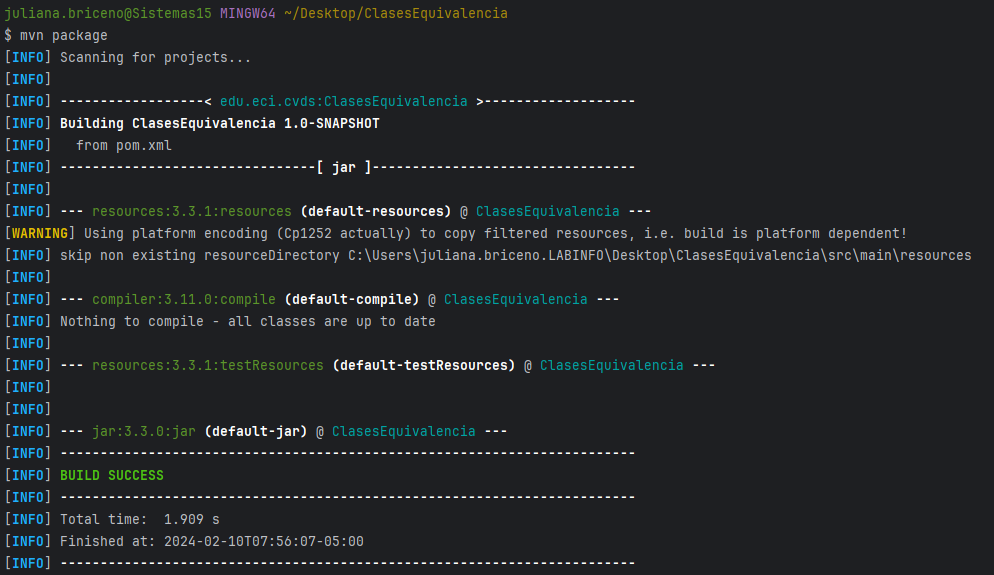
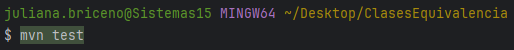
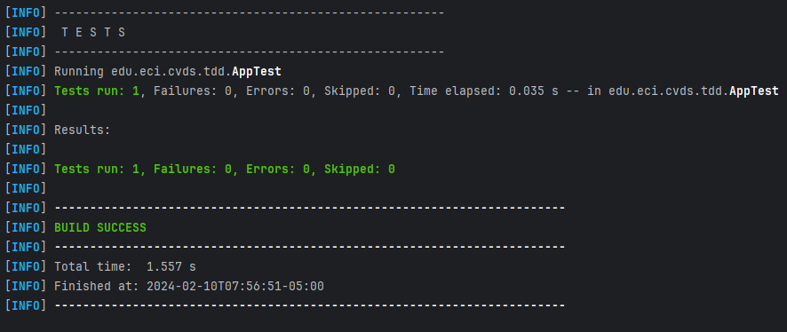
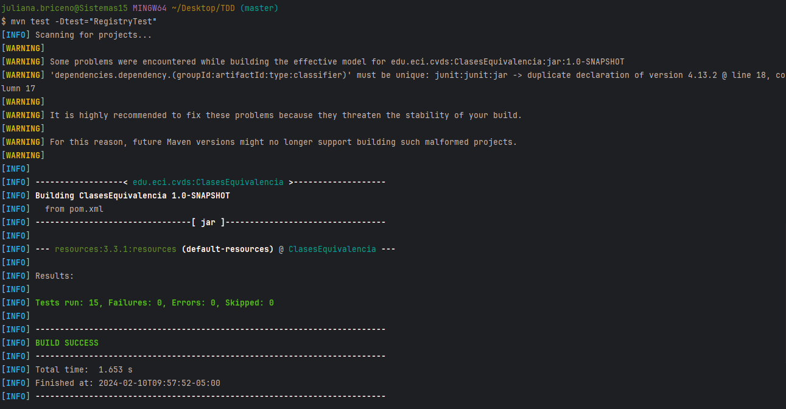
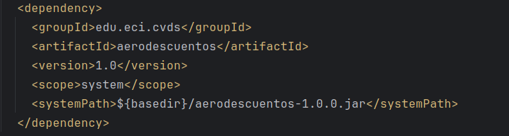
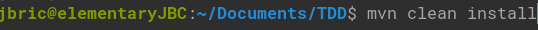
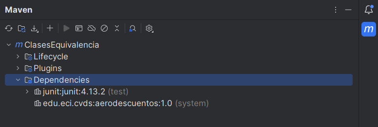
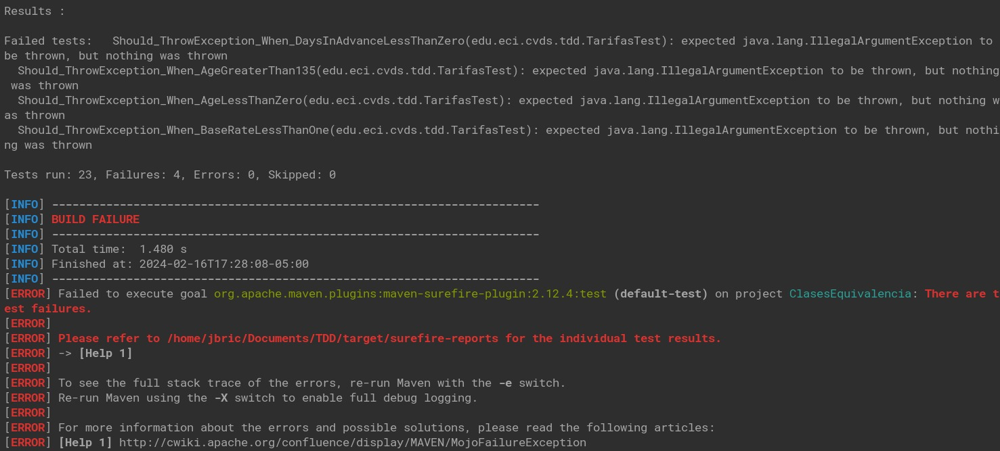

# LABORATORIO 3 - TDD

#### CLASES DE EQUIVALENCIA

### CREAR UN PROYECTO CON MAVEN
En el directorio de trabajo ejecutar el comando necesario para crear/generar un proyecto maven basado en un arquetipo:
```yml
Grupo (groupId): edu.eci.cvds
Artefacto (artifactId): ClasesEquivalencia
Paquete (package): edu.eci.cvds.tdd
archetypeArtifactId: maven-archetype-quickstart
```

### ACTUALIZAR Y CREAR DEPENDENCIAS EN EL PROYECTO

Busque en internet el repositorio central de maven.

Busque el artefacto JUnit y entre a la versión más nueva.


Ingrese a la pestaña de Maven y haga click en el texto de la dependencia para copiarlo al portapapeles.

Edite el archivo pom.xml y realice las siguientes actualizaciones:
- Agregue/Reemplace la dependencia copiada a la sección de dependencias.
- Hay que cambiar la versión delcompilador de Java a la versión 8, para ello, agregue la sección properties antes de la sección de dependencias:

```xml
<properties>
<maven.compiler.target>1.8</maven.compiler.target>
<maven.compiler.source>1.8</maven.compiler.source>
</properties>
```

### COMPILAR Y EJECUTAR
Ejecute los comandos necesarios de Maven, para compilar el proyecto y verificar que el proyecto se creó correctamente y los cambios realizados al archivo pom no generan inconvenientes.

Busque el comando requerido para ejecutar las pruebas unitarias de un proyecto desde Maven y ejecútelo sobre el proyecto. Se debe ejecutar la clase AppTest con resultado exitoso.



## EJERCICIO “REGISTRADURÍA”
Se va a crear un proyecto base para un cliente en la registraduría, en el cual se registrarán personas con intención de votar para las próximas
elecciones y se generarán los certificados electorales de aquellas personas cuyo voto sea válido.

Se usará la clase *persona* qué se describe más adelante. El servicio de la registradiría permitirá registrar personas que sean votantes.

### REQUERIMIENTOS
- Solo se registrarán votantes válidos
- Solo se permite una inscripción por número de documento

### HACER EL ESQUELETO DE LA APLICACION
Cree el archivo `RegisterResult.java` en el directorio `edu.eci.cvds.tdd.registry` con la enumeración:

```java
package edu.eci.cvds.tdd.registry;

public enum RegisterResult {
    DEAD, UNDERAGE, INVALID_AGE, VALID, DUPLICATED
}
```

Cree el archivo `Gender.java` en el paquete `edu.eci.cvds.tdd.registry` con la enumeración:

```java
package edu.eci.cvds.tdd.registry;

public enum Gender {
    MALE, FEMALE, UNIDENTIFIED;
}
```

Cree el archivo `Person.java` en el paquete `edu.eci.cvds.tdd.registry` con el siguiente contenido:

```java
package edu.eci.cvds.tdd.registry;
/**
 * Person representation Class
 */
public class Person {
    /**
     * Person's name
     */
    private String name;
    /**
     * A person's identification number
     */
    private int id;
    /**
     * Person's age
     */
    private int age;
    /**
     * Person's gender
     */
    private Gender gender;
    /**

     * Flag to specify if a person is alive
     */
    private boolean alive;
    /**
     * The class' default constructor
     */
    public Person() {
        super();
    }
    /**
     * A person constructor with all the information
     *
     * @param name the name
     * @param id the identification number
     * @param age the age
     * @param gender the gender
     * @param alive if the person is alive
     */
    public Person(String name, int id, int age, Gender gender, boolean alive) {
        this.name = name;
        this.id = id;
        this.age = age;
        this.gender = gender;
        this.alive = alive;
    }
    /**
     * Returns the person's name
     *
     * @return the name
     */
    public String getName() {
        return name;
    }
    /**
     * Returns the person's identification number *
     * @return the identification Number */
    public int getId() {
        return id;
    }
    /**
     * Returns this person's age
     *
     * @return the age
     */
    public int getAge() {
        return age;
    }
    /**
     * Returns the gender
     *
     * @return the gender
     */
    public Gender getGender() {
        return gender;
    }

    /**
     * Returns if the person is alive *
     * @return the alive
     */
    public boolean isAlive() {
        return alive;
    }
    /**
     * Sets the person's name
     *
     * @param name the name to set
     */
    public void setName(String name) {
        this.name = name;
    }
    /**
     * Sets the person's identification number *
     * @param id the identification Number to set */
    public void setId(int id) {
        this.id = id;
    }
    /**
     * Sets the person's age
     *
     * @param age the age to set
     */
    public void setAge(int age) {
        this.age = age;
    }
    /**
     * Sets the person's gender
     *
     * @param gender the gender to set
     */
    public void setGender(Gender gender) {
        this.gender = gender;
    }
    /**
     * Sets the flag to specify if this person is alive
     *
     * @param alive the alive to set
     */
    public void setAlive(boolean alive) {
        this.alive = alive;
    }
    /**
     * @{inheritdoc}
     */
    @Override
    public String toString() {
        return "Person [name=" + name + ", id=" + id + ", age=" + age + ", gender=" + gender + ", alive=" + alive + "]"; }
}
```

Cree el archivo `Registry.java` en el directorio `edu.eci.cvds.tdd.registry` con el método `registerVoter`:
```java
package edu.eci.cvds.tdd.registry;
public class Registry {
    public RegisterResult registerVoter(Person p) {
        // TODO Validate person and return real result.
        return RegisterResult.VALID;
    }
}
```

Cree la misma estructura de paquetes `edu.eci.cvds.tdd.registry` en la ruta `src/test/java`. Todos los archivos relacionados específicamente con los temas de pruebas, siempre deben ir bajo la carpeta `test`.

Bajo la carpeta de pruebas, cree la clase `RegistryTest.java` en el directorio `edu.eci.cvds.tdd.registry` de la siguiente manera:
```java
package edu.eci.cvds.tdd.registry;

import org.junit.Assert;
import org.junit.Test;

public class RegistryTest {
    private Registry registry = new Registry();
    @Test
    public void validateRegistryResult() {
        Person person = new Person();
        RegisterResult result = registry.registerVoter(person);
        Assert.assertEquals(RegisterResult.VALID, result);
    }
    // TODO Complete with more test cases
}
```

### EJECUTAR LAS PRUEBAS

Para correr las pruebas utilice:
```sh
$ mvn package
```
También puede utilizar:
```sh
$ mvn test
```
Revise cual es la diferencia. Tip: https://www.devopsschool.com/blog/maven-tutorials-maven-lifecycle-phases-goal

### FINALIZAR EL EJERCICIO
Piense en los casos de [equivalencia](https://prezi.com/-jp_rqhov1nn/particiones-o-clases-de-equivalencia/) que se pueden generar del ejercicio para la registraduría dadas las condiciones. Deben ser al menos 5.

Complete la implementación de la clase `RegistryTest.java` con (al menos) un método por cada clase de equivalencia, creando diferentes personas y validando que el resultado sea el esperado.

Complete la implementación del método `registerVoter` en la clase `Registry.java` para retornar el resultado esperado según la entrada.



## EJERCICIO "DESCUENTO DE TARIFAS"

### REALIZAR DISEÑO DE PRUEBAS
Para realizar de forma correcta el diseño de sus pruebas responda las preguntas que se encuentran en el siguiente [documento](https://campusvirtual.escuelaing.edu.co/moodle/pluginfile.php/142929/mod_assign/intro/EjercicioClasesEquivalencia.pdf).

1. De acuerdo con lo indicado, y teniendo en cuenta que NO hay precondiciones, en qué casos se debería
   arrojar una excepción de tipo ExcepcionParametrosInvalidos?. Agregue esto a la especificación.
   
    /**
   calcular la tarifa de cada billete según el trayecto, la antelación
   en la que se obtiene el billete y la edad del pasajero, de acuerdo
   con la normativa 005.
   @param tarifaBase valor base del vuelo
   @param diasAntelacion dias de antelación del vuelo
   @param edad - edad del pasajero
   @throws ExcepcionParametrosInvalidos [si tarifa base < 1 , dias de antelacion < 0, edad < 0 ó edad > 135 ]
   **/
   public long calculoTarifa(long tarifaBase, int diasAntelacion, int edad)

2. En la siguiente tabla enumere un conjunto de clases de equivalencia que -según usted- creen una
buena división del conjunto de datos de entrada de la función anterior:

   | Numero | Clase de equivalencia                | Resultado correcto / incorrecto |
   |--------|--------------------------------------|---------------------------------|
   | 1      | tarifa base < 1                      | incorrecto                      |
   | 2      | tarifa base >= 1                     | correcto                        |
   | 3      | dias de antelacion < 0               | incorrecto                      |
   | 4      | dias de antelacion >= 0              | correcto                        |
   | 5      | edad < 0                             | incorrecto                      |
   | 6      | edad >= 0                            | correcto                        |
   | 7      | edad > 135                           | incorrecto                      |
   | 8      | edad <= 135                          | correcto                        |
   | 9      | edad < 18                            | correcto                        |
   | 10     | edad >= 18                           | correcto                        |
   | 11     | edad <= 65                           | correcto                        |
   | 12     | edad > 65                            | correcto                        |
   | 13     | dias de antelacion <= 20             | correcto                        |
   | 14     | dias de antelacion > 20              | correcto                        |
   | 15     | dias de antelacion > 20 y edad < 18  | correcto                        |
   | 16     | dias de antelacion > 20  y edad > 65 | correcto                        |

3. Para cada clase de equivalencia, defina un caso de prueba específico, definiendo: parámetros de
   entrada y resultados esperados.
   1. Dado que tarifa base < 1, cuando quiero calcular la tarifa, el resultado esperado es excepcion
   2. Dado que tarifa base >= 1, cuando quiero calcular la tarifa, el resultado esperado es el calculo de la tarifa
   3. Dado que los dias de antelacion < 0, cuando quiero calcular la tarifa, el resultado esperado es excepcion
   4. Dado que los dias de antelacion >= 0, cuando quiero calcular la tarifa, el resultado esperado es el calculo de la tarifa
   5. Dado que edad < 0, cuando quiero calcular la tarifa, el resultado esperado es excepcion
   6. Dado que edad >= 0, cuando quiero calcular la tarifa, el resultado esperado es el calculo de la tarifa
   7. Dado que edad > 135, cuando quiero calcular la tarifa, el resultado esperado es excepcion
   8. Dado que edad <= 135, cuando quiero calcular la tarifa, el resultado esperado es el calculo de la tarifa
   9. Dado que edad < 18, cuando quiero calcular la tarifa, el resultado esperado es el calculo de la tarifa aplicando el descuento
   10. Dado que edad >= 18, cuando quiero calcular la tarifa, el resultado esperado es el calculo de la tarifa 
   11. Dado que edad <= 65, cuando quiero calcular la tarifa, el resultado esperado es el calculo de la tarifa
   12. Dado que edad > 65, cuando quiero calcular la tarifa, el resultado esperado es el calculo de la tarifa aplicando el descuento
   13. Dado los dias de antelacion <= 20, cuando quiero calcular la tarifa, el resultado esperado es el calculo de la tarifa
   14. Dado los dias de antelacion > 20, cuando quiero calcular la tarifa, el resultado esperado es el calculo de la tarifa aplicando el descuento
   15. Dado los dias de antelacion > 20 y edad < 18, cuando quiero calcular la tarifa, el resultado esperado es el calculo de la tarifa aplicando el descuento acomulado
   16. Dado los dias de antelacion > 20 y edad > 65, cuando quiero calcular la tarifa, el resultado esperado es el calculo de la tarifa aplicando el descuento acomulado

4. A partir de las clases de equivalencia identificadas en el punto 2, identifique las condiciones límite o
   Por cada numero de referencia entre los parametros, las condiciones límites son restarle 1, sumarle 1 y el valor en sí mismo
5. En la implementación.

### IMPLEMENTACIÓN DE LAS PRUEBAS
Descargue el archivo [`aerodescuentos.jar`](https://campusvirtual.escuelaing.edu.co/moodle/pluginfile.php/142929/mod_assign/intro/aerodescuentos-1.0.0.jar) y adicione esta nueva dependencia en el archivo `pom.xml` de su proyecto.




Para adicionar una librería personalizada al repositorio local de maven puede ejecutar el siguiente comando.
```sh
$ mvn install:install-file -Dfile=aerodescuentos-1.0.0.jar -DgroupId=edu.eci.cvds -DartifactId=aerodescuentos -Dversion=1.0.0 -Dpackaging=jar
```

Cree el archivo `TarifasTest.java` en el directorio `src/test/java/edu/eci/cvds/tdd/aerodescuentos`.

Realice la implementación de las pruebas propuestas en la etapa de diseño de pruebas en esta clase. Para sus pruebas debe usar el método `calculoTarifa` de la clase `edu.eci.cvds.tdd.aerodescuentos.CalculadorDescuentos`, que se encuentran dentro del JAR de la librería personalizada.

Ejecute el comando de Maven para las fases de compilación y pruebas. Verifique el resultado exitoso de todas las pruebas y el reporte generado.

Las 4 pruebas que fallan es porque en práctica el método no lanza excepciones en ninugn caso, sin embargo en el diseño se pensaron las clases de equivalencia para las excepciones. Lo ideal sería que para una próxima versión del código, las pruebas pasaran siendo que el método lanzaría las excepciones pertinentes.

## ENTREGAR
- Crear un repositorio para este proyecto y agregar la url del mismo, como entrega del laboratorio.
- Agregar y configurar el archivo `.gitignore` del repositorio para excluir la carpeta target y los archivos generados por el IDE que se haya usado. (ej. `.classpath`, `.idea`, `.settings`, etc.).
- Agregar el nombre de los integrantes que realizaron el laboratorio. Puede ser en un archivo `integrantes.txt` o agregándolos en el archivo `Readme` del repositorio.
- Terminar el laboratorio antes de la próxima sesión de laboratorio.

